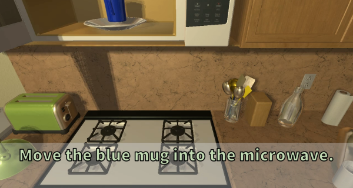
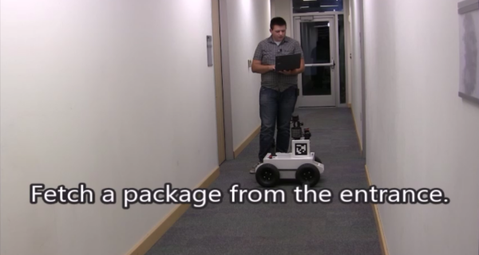
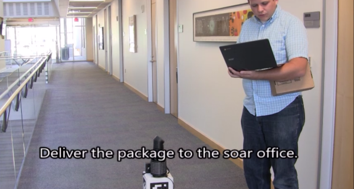
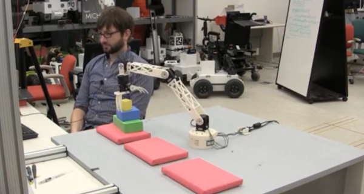
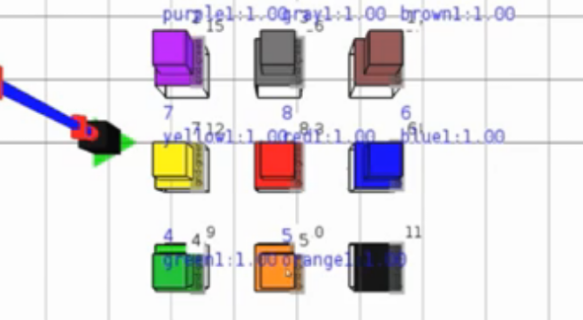
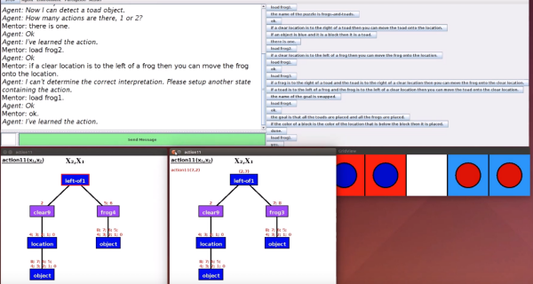

# Rosie ITL Agent

Rosie (RObotic Soar Instructable Entity) is an agent written in the 
Soar Cognitive Architecture that learns new tasks from scratch through situated interactive instruction. 
Rosie is part of research in the emerging area of Interactive Task Learning (ITL), 
and has been used to learn novel games, puzzles, household tasks, perceptual features, 
spatial relations, and hierarchical task concepts.  
What sets Rosie apart is its ability to learn completely new tasks and concepts from a single example 
and generalize its task knowledge in many different situations. 
It does this in an online, interactive manner where it detects missing knowledge and performs 
search or initiates new interactions to obtain that knowledge. 
Rosie is a project at the University of Michigan Soar Lab, led by Professor John E. Laird. 

**[- Videos](#videos)**  
**[- Publications](#publications)**

### Contributors

* James Kirk
* [John E. Laird](https://laird.engin.umich.edu/)
* Peter Lindes
* [Aaron Mininger](https://aaronmininger.com)
* [Shiwali Mohan](https://www.shiwali.me)

### Learn More

**[Recent powerpoint presentation about Rosie](https://drive.google.com/file/d/1uomKMdW7Ylsv0T6AXcr5ZoWIfTaOELvy/view?usp=sharing)**

**[Archive of Learnable Puzzles and Games](http://www-personal.umich.edu/~jrkirk/ijcai2019.html)**

**[Youtube Channel](https://www.youtube.com/channel/UCf5R6KZ2JDZKjR2-CjgCnEw)**

**[Soar Lab at Michigan](https://soar.eecs.umich.edu)**

**[Article in IEEE Magazine about ITL](https://web.eecs.umich.edu/~soar/sitemaker/docs/pubs/Laird_et_al_InteractiveTaskLearning_IEEE_IntelligentSystems_2017.pdf)**

**[Recent book describing ITL](https://books.google.com/books?hl=en&id=UU6qDwAAQBAJ)**

# Videos

## [Interior Guard](https://youtu.be/j9E0UYjGfhY)

This video from showcases Rosie learning to perform 
an interior guard task in a simulated barracks environment. 
Highlights include learning 'whenever' tasks, composite tasks, 
looping tasks, tasks with conditional actions, and ability to 
interrupt an already learned task to extend behavior. 

## [5-Puzzle with the Fetch robot](https://youtu.be/hc2gcrW96F4)

This video shows Rosie on the Fetch robotics platform solving a game of 5-puzzle after it had been taught through instruction. This is a variation of the 15-puzzle, where you must slide 15 scrambled tiles around to their original places.

## [Kitchen Tasks](https://youtu.be/baoKID1gVqE)

In this video featuring the ai2thor simulator, 
Rosie learns where to store objects, how to heat something in the microwave, and how to serve water. 
Highlighted capabilities include learning conditional goals, 
learning actions that depend on user preferences, and incorporating temporal conditions into the task. 

## [Learning Fetch](https://youtu.be/dzi-ACmi-2U)

In this video featuring the Magicbot, Rosie learns to fetch an object from another location and bring it back. A key step in this task is that Rosie learns to remember the starting location so it can go back there later, thus generalizing to different starting places. 

## [Learning Deliver](https://youtu.be/-i5bSS4CPts)

This video showcases Rosie learning the deliver task with the magicbot platform, 
where the goal is to deliver an object to the specified location.
In the video Rosie also learns to associate a new name with a location. 

## [Tower of Hanoi](https://www.youtube.com/watch?v=N6jOkKnpaHo)

Rosie learns the classic Tower of Hanoi puzzle with the
tabletop robotic arm. 

## [8 Puzzle](https://www.youtube.com/watch?v=R_65wzFKbTM)

Rosie learns to solve the 8 puzzle (a variant of the 15 tile sliding puzzle) in 
a simulation of the tabletop robot arm. 

## [Frogs and Toads](https://www.youtube.com/watch?v=RZUWEG-yHsI)

Rosie learns the Frogs and Toads jumping puzzle game. 
The video highlights the structures that are built up to recognize 
the actions, goal, and concepts such as 'placed'. 

# Publications

## Task Learning

**[Interactively Learning a Blend of Goal and Procedural Tasks](papers/Mininger.Learning_Blended_Tasks.2018.pdf)**  
2018 | *Aaron Mininger, John E. Laird*

Explains how the task-learning part of Rosie was extended to learn simple procedural tasks in an integrated manner.

**[Learning Task Goals Interactively with Visual Demonstrations](papers/Kirk.Learning_Task_Goals.2016.pdf)**  
2016 | *James Kirk, Aaron Mininger, John E. Laird*

Describes work that allows Rosie to learn task goals through visual demonstrations instead of linguistic descriptions. This was done with games, puzzles, and regular tasks on the tabletop robot. 

**[Learning Goal-Oriented Hierarchical Tasks from Situated Interactive Instruction](papers/Mohan.Learning_Hierarchical_Tasks_from_SII.2014.pdf)**  
2014 | *Shiwali Mohan, John E. Laird*

This paper details the first version of interactive task learning done in Rosie: 
learning goal-oriented hierarchical tasks in the tabletop domain using explanation based learning. 

**[Learning Grounded Language through Situated Interactive Instruction](papers/Mohan.Learning_Grounded_Language_through_SII.2012.pdf)**  
2012 | *Shiwali Mohan, Aaron Mininger, James Kirk, John E. Laird*

Describes an early version of the Rosie project with the tabletop blocks-world domain that can learn nouns (shapes), 
adjectives (colors), prepositions (spatial relations), and verbs (goal-based actions).

## Language Comprehension and Interaction

**[Grounding Language for Interactive Task Learning](papers/Lindes.Grounding_Language_for_ITL.2017.pdf)** 
2017 | *Peter Lindes, Aaron Mininger, John E. Laird*

Describes the Lucia comprehension system which uses Embodied Construction Grammar 
approach to perform grounded language processing in Soar which is used by Rosie.

**[Towards an Indexical Model of Situated Language Comprehension](papers/Mohan.Indexical_Model_of_Situated_Lang_Comp.2014.pdf)**  
2014 | *Shiwali Mohan, Aaron Mininger, John E. Laird*

Describes a computational model of situated language comprehension that incorporates knowledge from perception, domain knowledge, and short and long term experiences when generating semantic representations. 

## Perceptual Reasoning

**[Using Domain Knowledge to Correct Anchoring Errors in a Cognitive Architecture](papers/Mininger.Correcting_Anchoring_Errors.2019.pdf)**  
2019 | *Aaron Mininger, John E. Laird*

Details how Rosie uses its spatial memory to reason over perception and construct
a model of the world that is robust to certain anchoring errors and perceptual noise. 

**[Interactively Learning Strategies for Handling References to Unseen or Unknown Objects](papers/Mininger.Interactively_Learning_Strategies.2016.pdf)** 
2016 | *Aaron Mininger, John E. Laird*

Describes work done to extend Rosie to a mobile environment and how it handles references to objects that are not visible. Rosie learns different strategies for finding objects through instruction.

## Other

**[Expanding Task Diversity in Explanation-Based Interactive Task Learning](papers/Mininger.Proposal.2019.pdf)**  
2019 | *Aaron Mininger - Thesis Proposal*

This is an unpublished thesis proposal, but it gives a high-level overview of the current state of task learning
in Rosie and some of the new capabilities that have been added.

**[From Verbs to Tasks: An Integrated Account of Learning Tasks from Situated Interactive Instruction](http://www.eecs.umich.edu/~soar/sitemaker/docs/pubs/mohan_thesis_2015.pdf)**  
2015 | *Shiwali Mohan - Thesis*

Gives a very detailed account of Rosie, with a focus on interaction management and learning tasks. 
Although it is a bit outdated, the parts about how Rosie does dialog management and the theories
behind learning from SII are still very relavent. 

